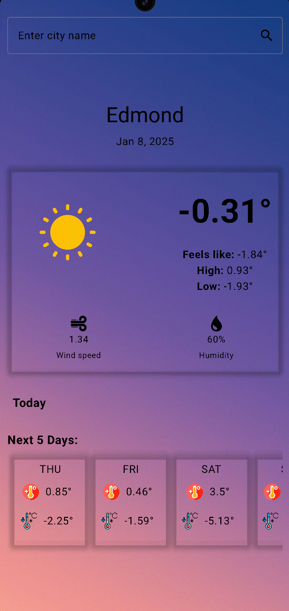

# Weather App using Jetpack Compose

This project is a simple weather application built using Jetpack Compose for Android. It retrieves weather data from the OpenWeatherMap API and displays it in a clean and user-friendly interface.

## Features

- **Current Weather:** Displays the current temperature, "feels like" temperature, high/low temperatures, wind speed, and humidity for a given city.
- **City Search:** Allows users to search for weather information by entering a city name.
- **5-Day Forecast:** Provides a forecast for the next five days, including high and low temperatures.
- **Clean UI:** Uses Jetpack Compose for a modern and responsive UI.
- **API Powered:** Uses the OpenWeatherMap API to get accurate and up-to-date weather data.

## Screenshot

## Technologies Used

- **Jetpack Compose:** Android's modern toolkit for building native UI.
- **Kotlin:** The primary programming language.
- **OpenWeatherMap API:**  Provides the weather data.
- **Retrofit:** For making network requests.
- **Coroutines:** For asynchronous tasks.

## OpenWeatherMap API

This application uses the OpenWeatherMap API to fetch weather information. You can visit [OpenWeatherMap](https://openweathermap.org/) to learn more about it. Make sure you have obtained your API Key from OpenWeatherMap and insert it in your local.properties file.
